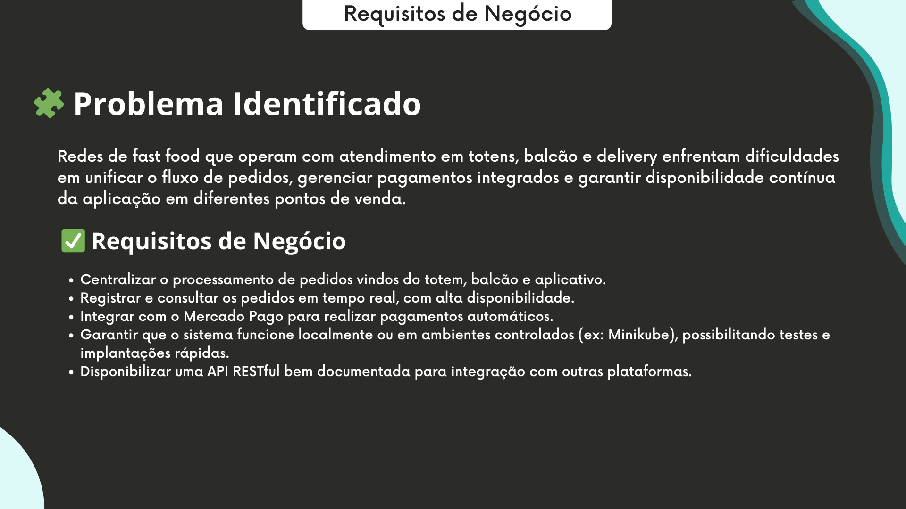
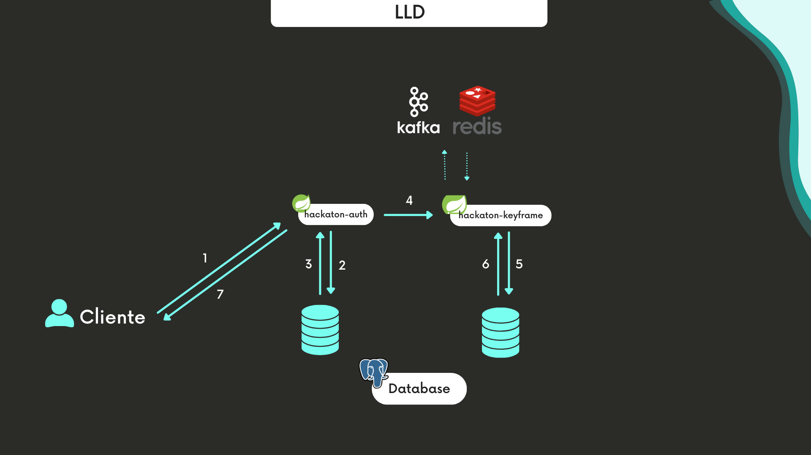
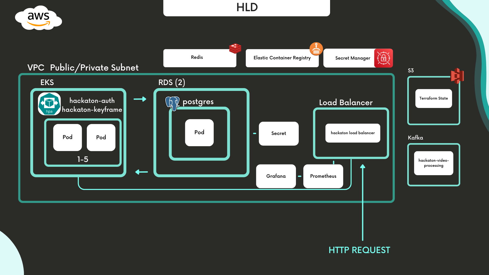
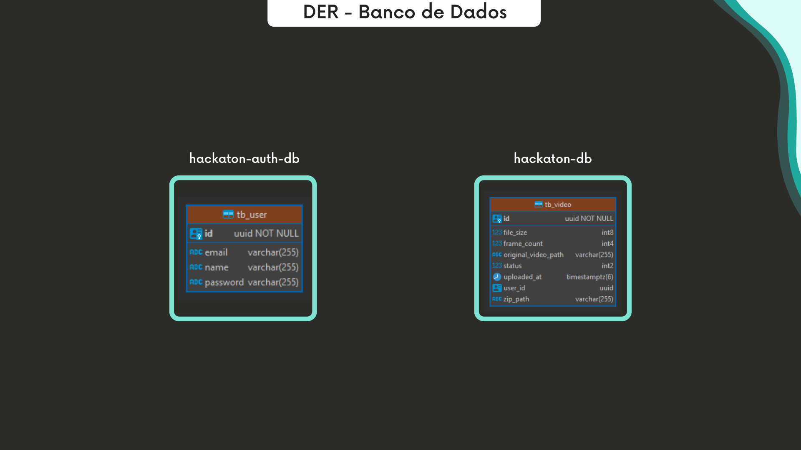
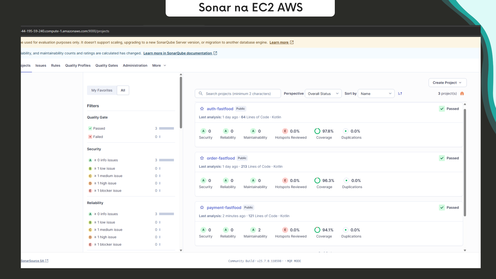
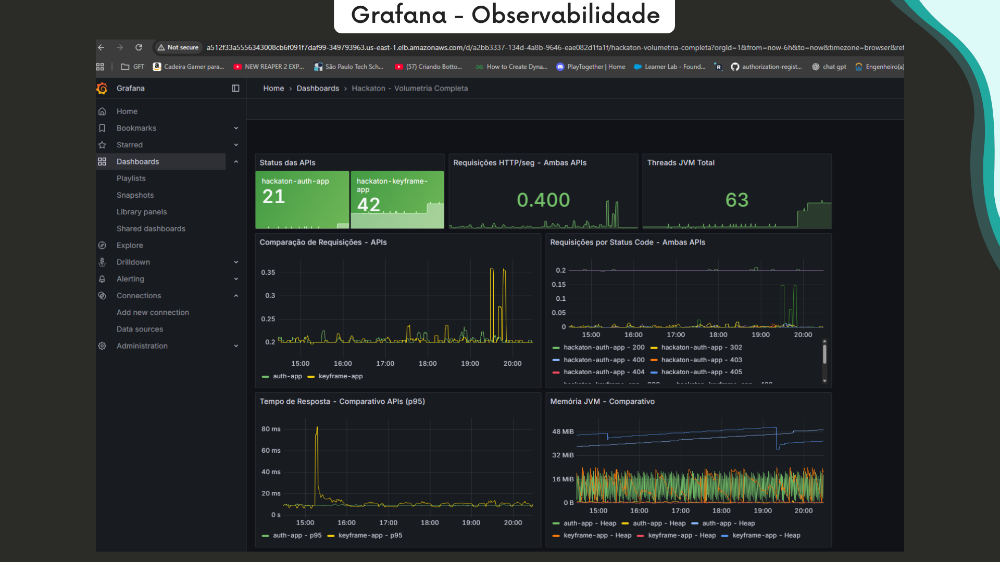

# Documentação do Projeto

Este repositório contém os principais artefatos de documentação referentes ao projeto, incluindo requisitos de negócio, diagramas de arquitetura, modelo de dados e evidências de qualidade.

## 📖 Apresentação Hackaton Fase 5 

A apresentação do projeto foi realizada no dia 28/07/2025:

SOAT \- TECH CHALLENGE \- HACKATON

GRUPO 17 (DISCORD) 62 (FIAP)

Participantes:

| Nome                             | Discord     |
|:---------------------------------|:------------|
| Frederico Teles Costa            | frdCosta    |
| Nathan Cordeiro Ribeiro da Silva | little\_rj1 |
| Gustavo Manocchio                | manocchio   |
| Fernando Marques dos Santos      | slabrx      |

Acessos:

| Titulo                   | Links                                                                                                                                                                                                                                                                                                                          |
|:-------------------------|:-------------------------------------------------------------------------------------------------------------------------------------------------------------------------------------------------------------------------------------------------------------------------------------------------------------------------------|
| GitHub \- Hackaton       | [https://github.com/group-17-fiap-soat/hackaton](https://github.com/group-17-fiap-soat/hackaton)                                                                                                                                                                                                                               |
| GitHub \- HackatonAuth   | [https://github.com/group-17-fiap-soat/hackaton-auth](https://github.com/group-17-fiap-soat/hackaton-auth)                                                                                                                                                                                                                     |
| Github \- Infra          | [https://github.com/group-17-fiap-soat/hackaton-infra](https://github.com/group-17-fiap-soat/hackaton-infra)                                                                                                                                                                                                                   |
| Github \- Database       | [https://github.com/group-17-fiap-soat/hackaton-database-trf](https://github.com/group-17-fiap-soat/hackaton-database-trf)                                                                                                                                                                                                     |
| Documentação             | [https://www.canva.com/design/DAGoOEMoO7I/vGbinQTXwE3_i8KhJq42FA/edit?utm_content=DAGoOEMoO7I&utm_campaign=designshare&utm_medium=link2&utm_source=sharebutton](https://www.canva.com/design/DAGoOEMoO7I/vGbinQTXwE3_i8KhJq42FA/edit?utm_content=DAGoOEMoO7I&utm_campaign=designshare&utm_medium=link2&utm_source=sharebutton) |
| Vídeo \- Youtube         | [MUDAR](https://www.youtube.com/watch?v=b7py2u_cs9I)                                                                                                                                                                                                                                                                           |

## 📌 Requisitos de Negócio

A imagem abaixo consolida os principais requisitos que nortearam o desenvolvimento do projeto:

---

## 🛠️ Diagrama de Baixo Nível (LLD)

Este diagrama apresenta a estrutura detalhada do sistema em nível de componentes e interações:

---

## ☁️ Arquitetura de Infraestrutura (HLD)

Diagrama de alto nível da arquitetura implementada na AWS, contemplando a adoção de banco NoSQL (Redis), containers via ECR e bancos relacionais (RDS) organizados por microserviço:

---

## 🧩 Modelo de Dados (DER)

Diagrama Entidade-Relacionamento (DER) dos bancos de dados dos microserviços `hackaton` e `hackaton-atuh` conforme a segmentação da arquitetura orientada a serviços:

---

## ✅ Qualidade de Código

Evidência do Quality Gate configurado no SonarQube, validando as entregas com no mínimo 80% de code coverage em todos os pipelines:

---

## 📊 Monitoramento via Grafana + Prometheus

Evidência do Grafana configurado na AWS utilizando o datasource Prometheus.

## 📄 Como contribuir

Sinta-se à vontade para abrir *issues*, sugerir melhorias ou enviar *pull requests*.

## 🧾 Licença

Este projeto está licenciado sob a [MIT License](./LICENSE).
